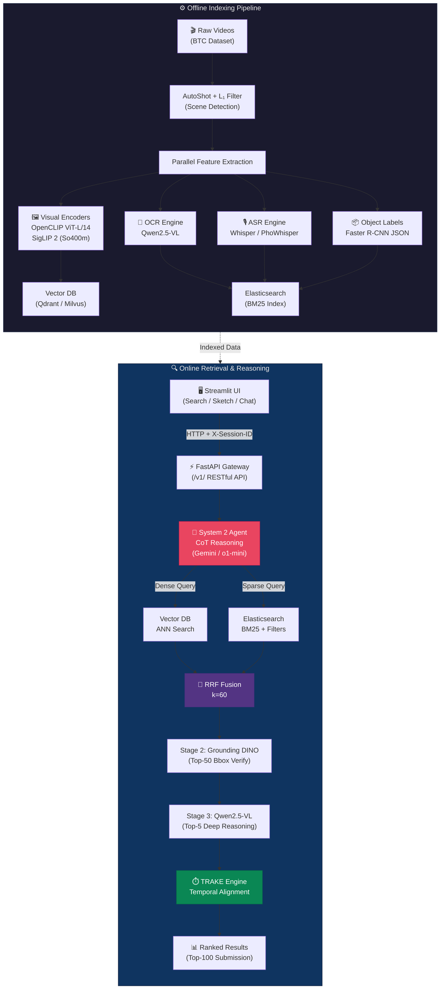

<p align="center">
  <h1 align="center">🎯 AIC2026-Multimedia-Agent</h1>
  <p align="center">
    <strong>Intelligent Multimedia Retrieval & Reasoning System for AIC 2026</strong>
  </p>
  <p align="center">
    <a href="#"></a>
    <a href="LICENSE"></a>
    <a href="#"></a>
    <a href="#"></a>
    <a href="#"></a>
    <a href="#"></a>
    <a href="#"></a>
  </p>
</p>

---

An agentic AI-powered multimedia retrieval system designed for the **Ho Chi Minh City AI Challenge 2026 (AIC 2026)**, compliant with international **Lifelog Search Challenge (LSC)** and **Video Browser Showdown (VBS)** standards. The system combines **hybrid dense-sparse search**, **System 2 Chain-of-Thought reasoning**, **multi-stage temporal alignment (TRAKE)**, and **cascading visual grounding** to locate precise moments across thousands of hours of egocentric video data — all optimized for laptop-grade GPU hardware.

---

## 📐 System Architecture



---

## ✨ Key Features

### 🔍 Hybrid Retrieval Engine
- **Dual-path search** combining dense vector similarity (Qdrant/Milvus + HNSW) and sparse keyword matching (Elasticsearch BM25)
- **Reciprocal Rank Fusion (RRF)** with `k=60` for optimal score merging across modalities
- **Mean-Centering / GR-CLIP** calibration to close the modality gap between text and image embeddings

### 🧠 Agentic AI (System 2 Reasoning)
- **Chain-of-Thought** query analysis via Gemini 2.0 Flash or OpenAI o1-mini
- **Automatic task routing**: KIS (localization), VQA (question answering), TRAKE (temporal alignment)
- **Generative Query Expansion** with bilingual Vi↔En translation for improved recall
- **Conversational KIS** with buffer memory for multi-turn refinement sessions

### ⏱️ TRAKE Temporal Alignment
- **Multi-stage temporal engine** decomposes queries into Q<sub>past</sub>, Q<sub>current</sub>, Q<sub>future</sub>
- **Strict temporal ordering** constraint: `index(r_p) < index(r_c) < index(r_n)` within same video
- **Weighted scoring**: `S_final(r_c) = w_c·Score(r_c) + w_p·Score(r_p) + w_n·Score(r_n)`

### 🎨 Multi-Modal Search
- **Text-to-Image** search with SigLIP 2 (So400m/NaFlex) for fine-grained detail recognition
- **Image-to-Image** re-query for exploitation-driven refinement
- **Sketch-to-Image** search via ControlNet + SDXL-Turbo pipeline
- **Visual Grounding** with Grounding DINO / OWL-ViT for bounding box verification

### 🏎️ VRAM-Optimized Cascading Pipeline
- **Stage 1 (Late-Fusion)**: SigLIP 2 + BM25 → Top-50 candidates in **<400ms**
- **Stage 2 (Re-score)**: Grounding DINO bbox verification in **<200ms**
- **Stage 3 (System 2)**: Qwen2.5-VL deep reasoning on **Top-5 only** → **<800ms**
- Saves **~70% VRAM** by restricting heavy VLM inference to final candidates

---

## 📊 Target Performance Metrics

| Metric | Target | Strategy |
|:---|:---:|:---|
| **R@1** | ≥ 0.60 | System 2 Agent + Qwen2.5-VL deep verification |
| **R@5** | ≥ 0.80 | RRF fusion + Grounding DINO spatial re-scoring |
| **R@100** | ≥ 0.95 | "Fill 100" strategy — always submit 100 ranked results |
| **Final Score** | ≥ 0.85 | `(R@1 + R@5 + R@20 + R@50 + R@100) / 5` |
| **End-to-End Latency** | < 2s | Cascading pipeline with early termination |
| **Peak VRAM** | < 8 GB | Qwen2.5-VL loaded only for Top-5 final reasoning |

---

## 🌐 API Endpoints

All endpoints are versioned under `/v1/` and require `Content-Type: application/json` + `X-Session-ID` headers.

| # | Method | Endpoint | Description | Latency Budget |
|:---:|:---:|:---|:---|:---:|
| 1 | `GET` | `/v1/health` | Heartbeat check for Qdrant, Elasticsearch, and model status | < 50ms |
| 2 | `POST` | `/v1/db/query` | Hybrid search: vector + BM25 + RRF fusion with metadata filters | < 400ms |
| 3 | `POST` | `/v1/rerank/early-fusion` | Qwen2.5-VL visual verification + VQA answer extraction | < 600ms |
| 4 | `POST` | `/v1/query/image-example` | Image-to-image similarity search (click-to-refine) | < 100ms |
| 5 | `POST` | `/v1/query/sketch` | Sketch-to-image search via ControlNet encoding | < 300ms |
| 6 | `POST` | `/v1/temporal/align` | TRAKE multi-stage temporal alignment engine | < 200ms |
| 7 | `POST` | `/v1/submission/submit` | Package and submit results to AIC competition server | < 100ms |

> 📖 Full API specification with request/response schemas: [`docs/api_contract.md`](docs/api_contract.md)

---

## 🛠️ Tech Stack

| Layer | Technology | Purpose |
|:---|:---|:---|
| **API Framework** | FastAPI + Uvicorn | Async REST API with auto-generated Swagger/ReDoc |
| **Frontend** | Streamlit | Interactive search UI, sketch board, timeline viewer |
| **Vector DB** | Qdrant | Dense vector storage with HNSW indexing (ANN < 10ms) |
| **Search Engine** | Elasticsearch | BM25 full-text search for OCR, ASR, Objects, Metadata |
| **Visual Encoder** | SigLIP 2 (`so400m-patch14-384`) + OpenCLIP ViT-L/14 | Fine-grained (primary) + global context feature extraction |
| **VLM** | Qwen2.5-VL (3B/7B) | OCR, VQA, deep visual reasoning |
| **ASR** | Whisper / PhoWhisper | Audio-to-text transcription (Vietnamese optimized) |
| **Object Detection** | Faster R-CNN (OIv4) | Pre-computed object labels (BTC-provided JSON) |
| **Visual Grounding** | Grounding DINO / OWL-ViT | Bounding box verification for spatial queries |
| **Sketch Pipeline** | ControlNet + SDXL-Turbo | Sketch-to-realistic image translation |
| **AI Agent** | Gemini 2.0 Flash / o1-mini | System 2 CoT reasoning and query routing |
| **Orchestration** | Docker Compose | Multi-service deployment (GPU passthrough) |

---

## 🚀 Quickstart Guide

### Prerequisites

- **Python** 3.11+
- **Docker** & Docker Compose v2
- **NVIDIA GPU** with CUDA 12.x (≥ 8GB VRAM recommended)
- **Git**

### 1. Clone the Repository

```bash
git clone https://github.com/<your-org>/AIC2026-Multimedia-Agent.git
cd AIC2026-Multimedia-Agent
```

### 2. Environment Setup

```bash
# Copy environment template and fill in your API keys
cp .env.example .env

# Create and activate virtual environment
python -m venv .venv
source .venv/bin/activate    # Linux/macOS
# .venv\Scripts\activate     # Windows
```

### 3. Install Dependencies

```bash
# Backend
pip install -r backend/requirements.txt

# Frontend
pip install -r frontend/requirements.txt
```

### 4. Launch Infrastructure (Docker Compose)

```bash
# Start Qdrant + Elasticsearch
docker compose up -d qdrant elasticsearch

# (Optional) Start all services including backend & frontend
docker compose up -d
```

### 5. Run the Backend

```bash
cd backend
uvicorn main:app --host 0.0.0.0 --port 8000 --reload
```

Access Swagger UI at: **http://localhost:8000/docs**

### 6. Run the Frontend

```bash
cd frontend
streamlit run app.py --server.port 8501
```

Access the UI at: **http://localhost:8501**

### 7. Ingest Data (Offline Pipeline)

```bash
# Download model weights
python models/download_models.py

# Extract and index keyframe features
python scripts/ingest_keyframes.py --data-dir data/raw/keyframes/

# Index metadata into Elasticsearch
python scripts/ingest_metadata.py --data-dir data/raw/

# Run benchmark
python scripts/benchmark.py --eval-set data/raw/eval/
```

---

## 📁 Project Structure

```
AIC2026-Multimedia-Agent/
├── backend/                    # FastAPI backend service
│   ├── main.py                 # App factory, CORS, router mounts
│   ├── api/v1/                 # 7 RESTful endpoint routes
│   ├── schemas/                # Pydantic request/response models
│   ├── services/               # Business logic (search, fusion, agent, rerank)
│   ├── core/                   # Config, logging, custom exceptions
│   └── db/                     # Database client wrappers (Qdrant, ES)
├── frontend/                   # Streamlit UI application
│   ├── app.py                  # Unified single-page dashboard
│   ├── components/             # Sidebar, grid, modals, cards
│   └── utils/                  # API client, image utilities
├── configs/                    # YAML configs, prompt templates
├── data/                       # Raw, processed, and mock data
├── docker/                     # Dockerfiles and compose overrides
├── models/                     # Model download scripts (weights at runtime)
├── scripts/                    # Ingestion, extraction, benchmarking scripts
├── tests/                      # Pytest test suite
└── docs/                       # Technical documentation
```

---

## 👥 Team Roles

| Member | Role | Primary Responsibility | Key Deliverables |
|:---:|:---|:---|:---|
| **M1** | Integration Lead & Agent Reasoning | System 2 Agent, RRF fusion, submission pipeline | `agent.py`, `fusion.py`, `chatbot.py`, `submission.py` |
| **M2** | Visual Grounding & Sketch Specialist | Deep visual verification, sketch search | `reranker.py`, `vlm_service.py`, `sketch_service.py` |
| **M3** | Temporal Engine & STAR Tools | TRAKE temporal alignment, timeline tools | `temporal_engine.py`, `timeline_viewer.py` |
| **M4** | Data Pipeline & Offline Indexing | Keyframe extraction, feature encoding, OCR/ASR | `ingest_keyframes.py`, `extract_ocr.py`, `embedding.py` |
| **M5** | Search Database & Benchmark | Hybrid DB infrastructure, search optimization | `vector_search.py`, `sparse_search.py`, `benchmark.py` |

> 📋 Detailed task assignments: [`docs/team_roles.md`](docs/team_roles.md)

---

## 🗺️ Development Phases

| Phase | Timeline | Focus | Exit Criteria |
|:---:|:---:|:---|:---|
| **Phase 1** | Days 1–2 | Mock Data & FastAPI Skeleton & Docker | All 7 endpoints return mock 200s; unified dashboard renders with mock data |
| **Phase 2** | Days 3–5 | DB Ingestion & Hybrid Search RRF | Real hybrid search with RRF; Recall@100 > 0.5 on sample data |
| **Phase 3** | Days 6–8 | System 2 Agent & Visual Grounding & TRAKE | Agent routes via Gemini 2.0 Flash; VLM reranking improves Top-5 by ≥15% |
| **Phase 4** | Days 9–10 | Dashboard Integration & E2E Testing | Full pipeline < 2s; VRAM < 8GB; competition rehearsal complete |

---

## 📈 Scoring Formula

The AIC 2026 competition uses the following evaluation metric:

$$R@k = \max_{1 \le i \le k} \{R\text{-}Score(r_i)\}$$

$$Final\ Score = \frac{1}{5} \sum_{k \in \{1, 5, 20, 50, 100\}} R@k$$

**Strategy:** Always submit 100 ranked results per query to maximize R@50 and R@100, pulling the Final Score upward even when Top-1 is uncertain.

---

## 🧪 Running Tests

```bash
# Run all tests
pytest tests/ -v

# Run with coverage
pytest tests/ --cov=backend --cov-report=html

# Run specific test module
pytest tests/test_fusion.py -v
```

---

## 🤝 Contributing

1. Fork the repository
2. Create a feature branch: `git checkout -b feature/your-feature`
3. Follow the code conventions in [`AGENTS.md`](AGENTS.md)
4. Write tests for new functionality
5. Submit a Pull Request with a clear description

---

## 📄 License

This project is licensed under the **MIT License** — see the [LICENSE](LICENSE) file for details.

---

## 🙏 Acknowledgments

- **[AIC 2026](https://aichallenge.hochiminhcity.gov.vn/)** — Ho Chi Minh City AI Challenge organizing committee
- **[Lifelog Search Challenge (LSC)](https://lsc.dcu.ie/)** — Dublin City University
- **[Video Browser Showdown (VBS)](https://videobrowsershowdown.org/)** — International video retrieval benchmark
- **[Vortex System](https://arxiv.org/html/2606.19682v1)** — Multi-modal fusion architecture reference
- **[SigLIP 2](https://huggingface.co/blog/siglip2)** — Google's next-gen vision-language encoder
- **[Qwen2.5-VL](https://huggingface.co/Qwen)** — Alibaba's vision-language model family
- **[lifeXplore](https://www.researchgate.net/publication/381542652)** — LSC 2024 champion system reference

---

<p align="center">
  <sub>Built with ❤️ for AIC 2026 by <strong>Team Multimedia Agent</strong></sub>
</p>