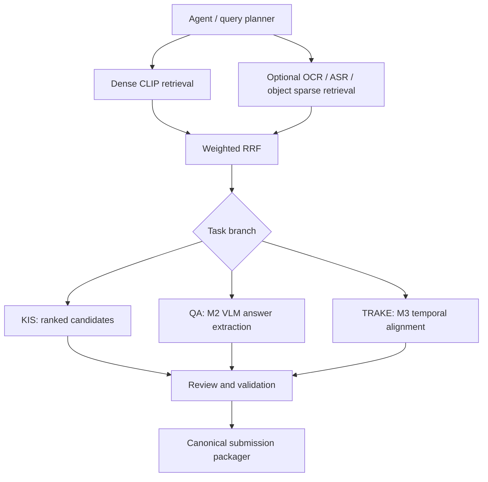

# AIC2026 Pipeline v2 — Integration Rationale and Roadmap

## 1. Purpose

This document records the technical decisions behind the standalone v1 baseline, the current M1–M5 integration
status, known runtime and data-contract limitations, and the work required to produce a complete v2 pipeline. It is
based on source present on branch `v1`; proposed components are identified as future work rather than existing
functionality.

## 2. Current v1 architecture

The runnable v1 baseline follows this offline path:

```text
Query ZIP
→ English visual variants
→ OpenAI CLIP ViT-B/32
→ official BTC 512-D feature shards
→ cosine retrieval
→ rank-only RRF
→ mapping resolution through n and frame_idx
→ JSON/CSV/HTML review artifacts
→ manual selection
→ submission packaging
```

The baseline does not require FastAPI, Streamlit, Qdrant, Elasticsearch, or Qwen. It reads local artifacts directly,
produces reviewable files, and packages a locally validated submission without automatic portal upload.

## 3. Why M2 is not active in v1 runtime

M2 visual-grounding and `VLMService` code exists on the development line represented by v1. Its public single-image
method accepts an explicit image path:

```python
await VLMService.extract_vqa_answer(query, image_path)
```

V1 did not run Qwen inference because the available local environment was CPU-only with CUDA unavailable, Qwen/VLM
inference was too heavy for the emergency deadline, and the immediate priority was producing a structurally valid
submission. QA therefore used CLIP candidate retrieval followed by manual review and answer entry.

This is a runtime activation decision, not a claim that M2 is unusable. The explicit-path method provides a viable
integration boundary. However, `VLMService.deep_reason()`, the grounding reranker, and some API paths currently use
the convention:

```text
<keyframe-root>/<video_id>/<frame_id padded to six digits>.jpg
```

The official artifacts used by v1 instead resolve images as:

```text
<keyframe-root>/<video_id>/<keyframe_id padded to three digits>.jpg
```

The true submission `frame_id` comes from mapping `frame_idx`; it is not the keyframe filename. V2 must therefore
pass the explicit `image_path` or `thumbnail_path` already resolved from mapping metadata. It must not reconstruct an
image filename from the true frame ID.

## 4. Why v1 contains a temporal fallback instead of M3 integration

When the v1 submission path had to run, the development branch did not contain a runnable temporal integration that
closed the complete path from a multi-event query to same-video ordered frames and finally to a submission row. The
existing temporal endpoint is explicitly a mock-phase endpoint: it returns mock data when available and otherwise
returns an empty sequence with a message that the temporal engine is not connected. No canonical
`backend/services/temporal_engine.py` implementation exists on v1.

Because the deadline could not wait for another integration, v1 added a standalone temporal fallback. It:

- searches each event independently;
- groups candidates by `video_id`;
- requires strictly increasing true frame IDs;
- ranks valid sequences deterministically;
- generates offline HTML review artifacts.

This is a temporary v1 fallback and is not presented as the canonical M3 implementation. V2 must review, standardize,
or replace it with an official M3 service when such a service is available and satisfies the same data contract.

## 5. M4 artifact compatibility decision

V1 did not use the available SigLIP2 artifact for final retrieval. That artifact contains 96,894 feature rows with
1,536 dimensions, while the official mappings and keyframes used by the submission path contain 177,321 rows. A
feature row cannot be paired with a mapping row when row counts and row identity do not correspond.

V1 instead uses the official BTC OpenAI CLIP ViT-B/32 artifacts:

- 873 videos;
- 177,321 feature rows;
- 512 dimensions;
- row counts aligned with the official mapping CSVs and keyframes.

This is a data-contract compatibility decision, not an assessment of M4 model quality. V2 may use SigLIP2 when it is
delivered with an exact mapping for every feature row, corresponding keyframes, a model/checkpoint manifest, a
normalization contract, and a reproducible extraction pipeline.

## 6. Ownership and integration status

| Area | v1 status | v2 target |
| --- | --- | --- |
| M1 | RRF, orchestration, validation, and packaging are available. | Unify canonical schemas and pipeline orchestration. |
| M2 | Visual-grounding/VLM code exists; Qwen is inactive in the v1 runtime. | Run GPU VLM inference using explicit image paths. |
| M3 | A standalone temporal fallback provides ordered sequence assembly. | Provide a canonical, tested temporal service. |
| M4 | Official BTC artifacts are consumed directly through their mappings. | Deliver a versioned, reproducible artifact contract and index. |
| M5 | CLIP retrieval and multi-query rank-only RRF are active. | Add compatible hybrid retrieval, optimization, and online integration. |

## 7. Work required for v2

### P0 — Correctness

- Remove manual and fallback QA answers from the runtime result path.
- Run M2 VLM inference on an appropriate GPU environment such as Kaggle.
- Pass explicit `image_path` values resolved from mapping metadata.
- Validate that every QA answer is non-blank and no longer than 100 characters.
- Standardize the TRAKE temporal engine.
- Preserve the true submission frame ID from mapping `frame_idx`.
- Unify the submission schema and remove conflicting parallel implementations.
- Record provenance for the query ZIP, model, features, mappings, and query variants.

### P1 — Retrieval quality

- Add controlled Vietnamese-to-English query planning or translation.
- Add OCR retrieval for numbers, signs, and visible text.
- Add ASR signals when compatible artifacts are available.
- Add object and BM25 sparse retrieval only when their artifacts satisfy an explicit compatibility contract.
- Fuse dense and sparse rankings with weighted RRF.
- Generalize two-event and multi-event retrieval for queries that describe a progression.
- Add temporal-neighborhood reranking.
- Improve candidate diversity and duplicate suppression.

### P1 — M2 integration

- Define an `M2VLMAnswerProvider` adapter.
- Establish GPU, device, and configuration lifecycle management.
- Load the model once per runtime.
- Run inference on a bounded top-N candidate set.
- Add answer consensus and confidence handling.
- Do not expose chain-of-thought.
- Define explicit failure handling and a visible manual-review fallback.
- Keep unit tests weight-free and mark GPU integration tests separately.

### P1 — M3 integration

- Accept generic N-event input.
- Enforce a same-video constraint.
- Enforce strict temporal ordering.
- Use bounded beam search or dynamic programming for sequence assembly.
- Preserve an event-specific score breakdown.
- Define deterministic tie-breaking.
- Provide sequence visualization.
- Test missing events, duplicate labels, no valid sequence, and four-event TRAKE.

### P1 — M4 integration

Define a minimum artifact manifest containing:

- model identifier;
- pretrained checkpoint;
- embedding dimension;
- dtype;
- normalized flag;
- video count;
- row count;
- dataset and keyframe version;
- checksums.

Every feature row must resolve unambiguously to:

- `video_id`;
- `keyframe_id`;
- true `frame_id`;
- timestamp;
- image path.

The loader must fail closed on a missing mapping, row-count mismatch, invalid dimension, or incompatible manifest.

### P2 — Productionization

- Use configuration rather than hard-coded local paths.
- Make local and Kaggle runs reproducible.
- Add safe resume and caching.
- Add repeatable performance benchmarks.
- Provide an optional FastAPI endpoint.
- Provide an optional Streamlit review UI.
- Use structured logging.
- Add CI lint and test gates.
- Version output manifests.
- Keep portal upload manual.

## 8. Proposed v2 runtime architecture



## 9. Definition of Done for v2

- [ ] Official data gate passes.
- [ ] No feature/mapping mismatch is accepted.
- [ ] KIS, QA, and TRAKE run from one CLI and configuration contract.
- [ ] QA uses no hard-coded fallback answer.
- [ ] M2 receives explicit image paths.
- [ ] TRAKE supports N events.
- [ ] Candidate and sequence provenance is complete.
- [ ] The submission ZIP passes local validation.
- [ ] A Kaggle GPU run is reproducible.
- [ ] Unit, scoped, and full test suites pass.
- [ ] No competition data, model, output, or secret is stored in Git.
- [ ] No automatic portal upload occurs.

## 10. Known non-goals

- Do not commit the competition dataset.
- Do not commit model weights.
- Do not commit official query text or answers.
- Do not submit results automatically.
- Do not claim SigLIP2 compatibility without an exact row mapping.
- Do not require FastAPI, Qdrant, or a UI for the offline baseline.

## 11. Migration plan from v1 to v2

1. Freeze v1 as the reproducible standalone reference.
2. Standardize and validate the artifact manifest.
3. Fix the explicit image-path contract across reranking and VLM flows.
4. Integrate M2 on a Kaggle GPU runtime.
5. Formalize the M3 temporal service.
6. Add compatible OCR, ASR, and object signals.
7. Unify schemas and CLI orchestration.
8. Run end-to-end evaluation and review failure cases.
9. Tag v2 only after all acceptance gates pass.
